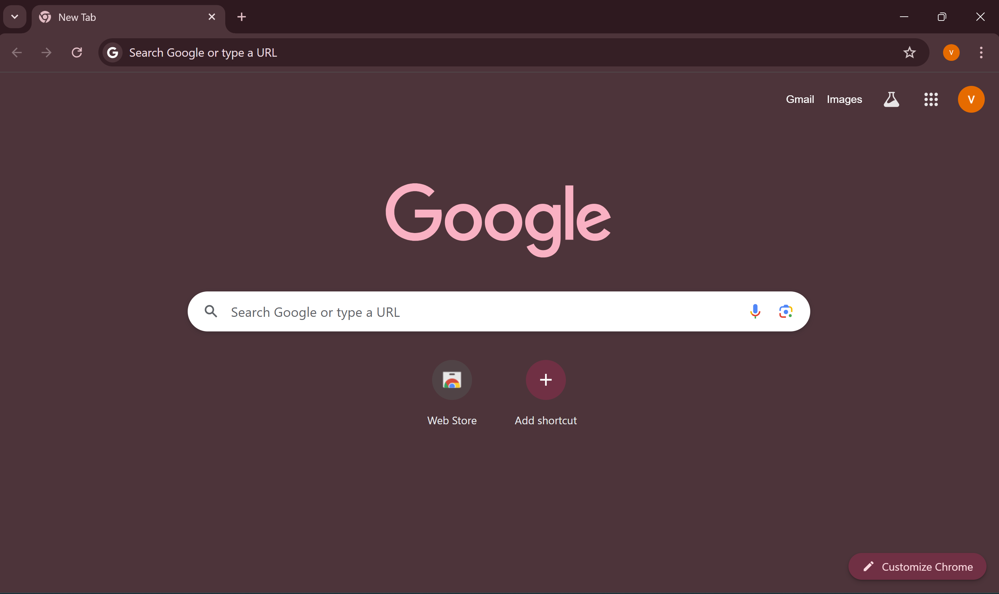
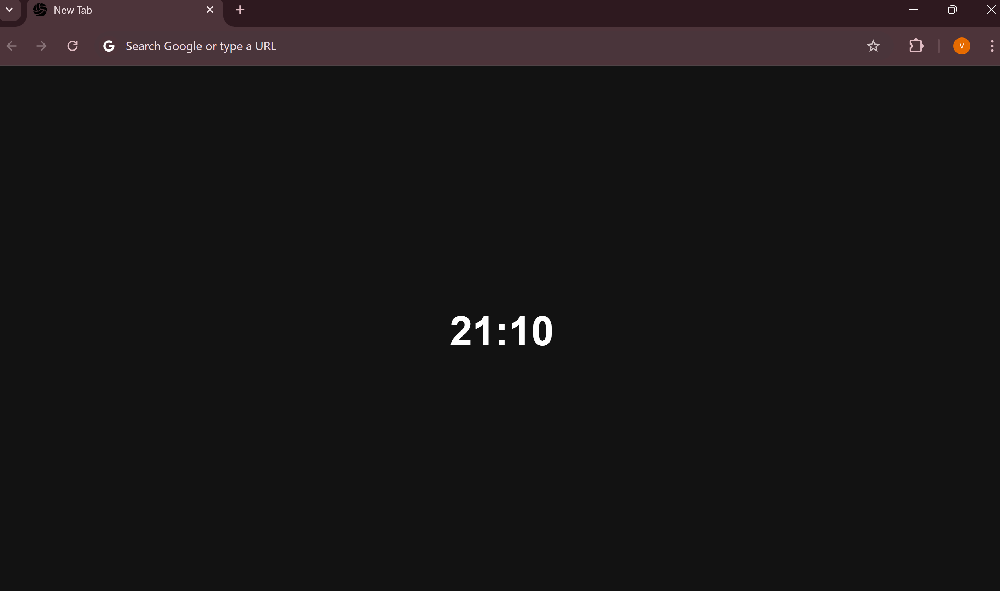

# new-tab-chrome-extension

Extension for New Tab for Chrome Browser
only showing clock in new Tab 

Default new Tab is distracting and is not minimal
and cause context switches.

Keeping clock and 
removing search block, recently used websites and bookmarks bar 
makes new Tab minimal and less distracting.

# Screenshots
Default New Tab

With New Tab Extenstion

# Development

## Start
1. Clone the project
2. Make changes
3. Go to chrome://extensions in Chrome Browser
4. Enable Develoer mode
5. Click on load unpacked
6. Select project folder
7. Enable Extension
8. Click on New Tab, should show new tab with clock showing present time

## Editing
1. Making New Changes, refresh the extension in chrome://extensions Tab
2. Click on New Tab, should show new changes

# References
1. [Minimal New Tab](https://chromewebstore.google.com/detail/danoojfpckpaacgbaebfakjeepeenaop)
